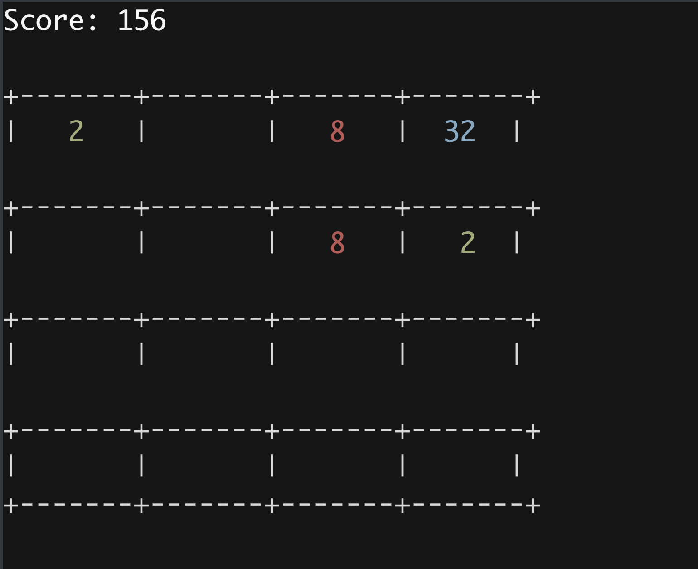
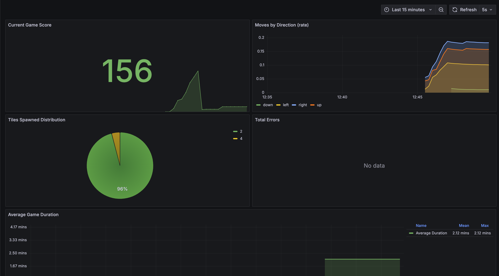

# 2048 Game Implementation Guide

This project is an Object-Oriented Programming (OOP) concepts through building a fun and interactive game.



## What is 2048?

2048 is a sliding tile puzzle game where you combine numbered tiles to create a tile with the number 2048. The game is played on a 4x4 grid (by default), where you can slide tiles in four directions (up, down, left, right). When two tiles with the same number collide, they merge into one tile with their sum.

## How We Built It: A Step-by-Step Guide

Let's break down how this game is built using Object-Oriented Programming principles:

### 1. The Core Game Logic (`src/game/board.py`)

The heart of our game is the `Board` class, which represents the game grid. Here's how it works:

```python
class Board:
    def __init__(self, size: int = 4):
        self.size = size
        self.grid = [[0] * size for _ in range(size)]  # Creates a size x size grid filled with zeros
        self.score = 0
```

Key OOP Concepts Used:
- **Classes**: The `Board` class encapsulates all the game's data and behaviors
- **Attributes**: `size`, `grid`, and `score` are properties that store the game's state
- **Methods**: Functions that manipulate the game state

Important Methods:
1. `add_new_tile()`: Adds a new 2 or 4 tile to a random empty spot
2. `move(direction)`: Handles tile movement in a specified direction
3. `_merge_line()`: Combines tiles with the same number
4. `is_game_over()`: Checks if no more moves are possible

### 2. User Interface (`src/game/display.py`)

The game's visual representation in the terminal is handled by the display component. It:
- Shows the current game grid
- Displays the score
- Provides colored output for better visibility

### 3. Game Controller (`src/game/controller.py`)

This component:
- Handles keyboard input
- Manages the game loop
- Connects the board logic with the display

### 4. Additional Features

We've added several advanced features to make the game more robust:

1. **Configuration System** (`src/utils/config.py`):
   - Allows customizing game settings (board size, winning score)
   - Uses YAML files for easy configuration

2. **Logging** (`src/utils/logger.py`):
   - Tracks game events and errors
   - Helps with debugging

3. **Metrics Collection** (`src/monitoring/`):
   - Records game statistics
   - Monitors performance using Prometheus
   - Tracks metrics like:
     * Total moves by direction
     * Current score
     * Game duration
     * Error counts
     * Tile spawn statistics

### 5. Monitoring with Prometheus and Grafana

The game includes comprehensive monitoring capabilities using Prometheus for metrics collection and Grafana for visualization. Here's what the game looks like in action:


#### Setting up Monitoring with Docker Compose

1. Start Prometheus and Grafana using Docker Compose:
```bash
docker-compose up -d
```

2. Verify the services are running:
- Metrics exporter: http://localhost:8888/metrics (only starts when game starts)
- Prometheus UI: http://host.docker.internal:9090
- Grafana UI: http://localhost:3000 (login with admin/admin)

3. Configure Grafana:
   - Login to Grafana at http://localhost:3000 (username: admin, password: admin)
   - Add Prometheus data source:
     1. Go to Configuration > Connections > Add data source
     2. Select Prometheus > Add new data source
     3. Set URL to http://host.docker.internal:9090
     4. Click "Save & Test"
   
4. Import the dashboard:
   - Go to Dashboards > New > Import
   - Click "Upload Dashboard JSON file"
   - Select `src/monitoring/grafana-dashboard.json`
   - Click "Import"

Here's what the dashboard looks like after importing:



The dashboard provides rich insights into your gameplay:
- Real-time game score tracking
- Move patterns analysis showing your preferred directions
- Distribution of spawned tiles (2's vs 4's)
- Error rate monitoring
- Game duration statistics and trends

Note: The docker-compose setup automatically handles all service configuration and networking. If you're running Docker Desktop on macOS, the prometheus.yml is already configured to use `host.docker.internal` for accessing the metrics exporter.

To stop the monitoring services:
```bash
docker-compose down
```

This monitoring system helps you:
- Analyze your gameplay patterns in detail
- Track performance metrics with rich visualizations
- Understand game statistics through interactive dashboards
- Debug issues using real-time data and historical trends

## How to Play

For the best experience, we recommend using your system's native terminal instead of an IDE's embedded terminal, as some IDEs may have issues with keyboard input handling.

1. Set up a Python virtual environment (recommended):
```bash
# Create a virtual environment
python -m venv venv

# Activate the virtual environment
# On macOS/Linux:
source venv/bin/activate
# On Windows:
# venv\Scripts\activate
```

2. Install the required packages:
```bash
pip install -r requirements.txt
```

3. Run the game:
```bash
python src/main.py
```

4. Use arrow keys to move tiles:
- ↑: Move up
- ↓: Move down
- ←: Move left
- →: Move right
- q: Quit game

## Understanding the Code Flow

When you make a move:
1. The controller detects your keypress
2. The board processes the move:
   - Slides all tiles in the chosen direction
   - Merges tiles with the same number
   - Calculates new score
3. A new tile (2 or 4) appears in a random empty spot
4. The display updates to show the new state
5. The game checks if you've won or lost

## Learning Exercises

1. **Basic**: Try modifying the board size or winning condition
2. **Intermediate**: Add a new feature like move undoing
3. **Advanced**: Implement an AI solver for the game

## Testing Your Understanding

The project includes tests (`src/tests/`) that verify the game logic. Reading and understanding these tests can help you grasp how the game should behave in different scenarios.

## Project Structure Visualization

```
src/
  ├── game/           # Core game components
  │   ├── board.py    # Game logic and rules
  │   ├── display.py  # Visual representation
  │   └── controller.py # Input handling
  ├── utils/          # Helper functions
  │   ├── config.py   # Game settings
  │   └── logger.py   # Event logging
  ├── monitoring/     # Game statistics
  └── tests/          # Verification
```

This implementation demonstrates key software engineering principles:
- **Encapsulation**: Each class handles its own data
- **Separation of Concerns**: Different components handle specific tasks
- **Modularity**: Code is organized into logical units
- **Testability**: Game logic can be verified independently

Remember: The best way to learn is by doing! Try making small modifications to the code and see how they affect the game. Happy coding! 🎮
